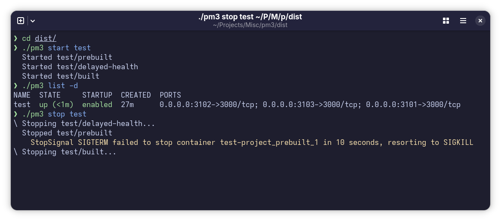

<h1 align="center">
  PM3 = PM2 + PodMan<br>
  
</h1>

<div align="center">
<a href="https://copr.fedorainfracloud.org/coprs/exposedcat/pm3/package/pm3/">

</a>

<a href="https://coff.ee/exposedcat" target="_blank"></a>

[](https://t.me/ExposedCatDev)
[](https://www.reddit.com/user/ExposedCatDev)

</div>

<br>

# pm3

`pm3` is a Podman Compose project manager.

It keeps normal Compose files, stores registered projects in SQLite, starts and
stops stacks with `podman-compose`, and runs an autostart daemon so startup
policy and hooks keep working after boot.

## Requirements

- `podman`
- `podman-compose`
- a compose file in the project directory: `podman-compose.yaml`,
  `podman-compose.yml`, `compose.yaml`, `compose.yml`, `docker-compose.yaml`, or
  `docker-compose.yml`; pass `podman-compose` arguments after `--` when needed

## Quick Start

```sh
pm3 create ./apps/web --name website
pm3 create ./apps/api --name api -- -f compose.prod.yaml
pm3 enable website --now
pm3 list --detailed
```

## Docs

See [`Wiki`](https://github.com/ExposedCat/pm3/wiki) for full docs.

## Common Commands

```sh
pm3 start website
pm3 restart website
pm3 stop website
pm3 logs website api worker
pm3 rm website
pm3 daemon start
pm3 daemon logs --since 1h --lines 200
pm3 daemon stop
```
